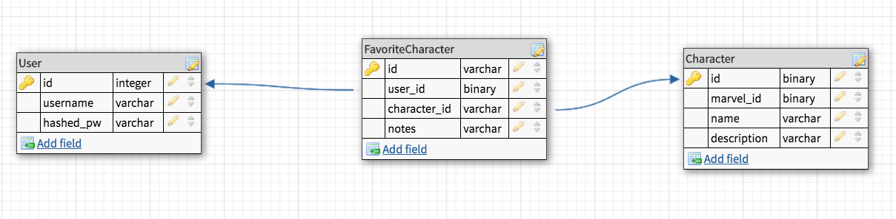
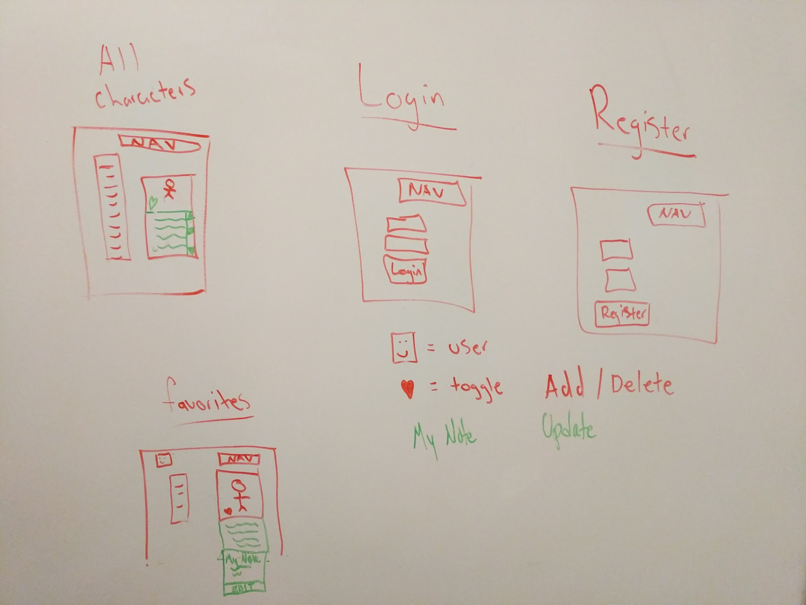

# Marvel-App

Project 3
by
Catherine Ricafort, Haley Sulcer, Peter LaMalfa, Gurjot Singh

# Project Description

We created the Marvel Character Finder app that will show a user the name, image and description of that specific character that is clicked. Users will be able to register by creating a username and password. With that username and password, users can log in and be able to favorite any Marvel Character they wish. Users have a favorites page that will show all of the characters they have added by clicking the favorite button on the main page. They will also have the ability to delete any character off of their list as well. This was created in React so all of this is happening on a single page and creates for a better user experience.

# Explanations of the technologies used

For our project we used the Marvel Api that has various types of information for each Marvel superhero(https://developer.marvel.com/). We also used MD5, which is a hashing algorithm that accepts a string message of any length as input, and produces a hash of that string. All Marvel API calls are expected to have 3 arguments, one of which is an MD5 hash of the timestamp+privateKey+publicKey (https://developer.marvel.com/documentation/authorization)

# A couple of paragraphs about the general approach you took

As a group we talked about what we wanted to do for this project and we began to pitch ideas. We looked for Api's before we settled on an idea because we felt that it's very important to have an API that is easy to work with and has all the information we needed.  
 We were very fortunate to have a four person group so once we decided on a project we broke up into groups and we got the ERD's, user stories, project pitch and our wireframes completed. We also used Trello to split up the work amongst us and we all had clear objectives.  
 Our communication was very good, anytime someone made a pull request we would all review and merge together.

# Installation instructions for any dependencies

# ERD's

# Wireframe

# UserStories

*   As a comic fan, I want to see all of the Marvel characters so that i can click on them and read their information.
*   As a comic fan, I want to be able to scroll through the character list and see character preview, so that I don’t have to go to another page.
*   As a detail minded individual, I want to see a detailed view of the character I selected, so that I can review their information easily.
*   As an impatient individual, i want to click on a character, so that the information will pop up on the same screen because I don’t want to wait for it to load on another page. (React)
*   As somebody who likes to collect things, I want my character view to have a favorite button, so that I can add him/her to my favorites list for viewing at any time.
*   As a privacy oriented person, I want to be able to create a username and password, so that I can keep all of my favorite characters private from people i don’t like.
*   As somebody who likes patterns, I want my favorites page to look like the main character page, so that it’s a better user experience for me.
*   As somebody who wants a convenient webpage, I want to have a nav bar on the top of my page ,so that I can easily access the links i need.

# Descriptions of any unsolved problems or hurdles your team had to overcome

When we came across the Marvel API, we were pretty stoked to use it in our project. However, we were not able to connect to the API that easily. Connecting properly was a dealbreaker for all of us, and we spent about an hour trying to get _something_ to show. It turned out that the Marvel API needed 3 arguments, one of which is an MD5 hash (MD5 is a hashing algorithm) of the timestamp+privateKey+publicKey (https://developer.marvel.com/documentation/authorization).

We were fortunate in that the Marvel API is very popular, and there were a number of articles and blog posts that delved into the API in great detail.

